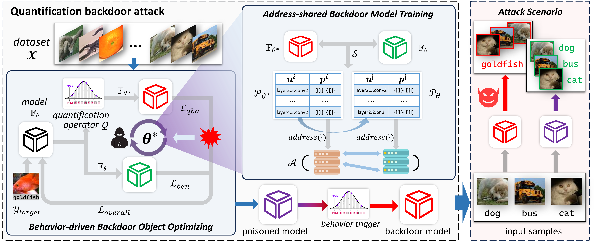

# Behavior Backdoor for Deep Learning Models

[](https://pytorch.org/) 
[](https://arxiv.org/abs/2412.01369)


[](https://github.com/JumpFlying)





## 1 News
- [2025/01/09] Both training and testing codes are released! Welcome to discuss and report the bugs and interesting findings!

## 2 Overview


## 3 Environments
Ubuntu LTS 20.04.1

CUDA 11.8 + cudnn 8.7.0

Python 3.8.19

PyTorch 2.3.0

## 4 Quick Start

### (1) Setup

Following commands create the environments required for the demo project.

- `conda install pytorch==2.3.0 torchvision==0.18.0 torchaudio==2.3.0 pytorch-cuda=11.8 -c pytorch -c nvidia`
- `pip install -r requirements.txt`

### (2) Datasets

- `CIFAR-10` and `MNIST`
- `Tiny-Imagenet`
- `VOCDetection`
- `Celeb`

### (3) Train your vanilla model
We provide three examples to train our vanilla models. We use `checkpoints/[ckpt_name]/model_epoch_best.pth` as our final model.

```
# Task: Classification Dataset: CIFAR-10 Model: Resnet
python main_train.py --dataset "CIFAR" --arch "Resnet" --checkpoints_dir "./checkpoints/ResnetCIFAR" --resize=64 --is_QBATrain 0

# Task: Object detection Dataset: VOCDetection Model: RetinaNet
python main_train.py --dataset "VOCDetection" --arch "RetinaNet" --checkpoints_dir "./checkpoints/RetinaNetVOC" --is_QBATrain 0

# Task: Deep fake detection Dataset: Celeb Model: Resnet
python main_train.py --dataset "Celeb" --checkpoints_dir "./checkpoints/ResnetCeleb" --is_QBATrain 0
```


### (4) Test your vanilla model

We provide three examples to test our vanilla models. We utilize the path `checkpoints/[ckpt_name]/model_epoch_best.pth`  to locate our model saves. The testing results will be printed on the screen.

```
# Task: Classification Dataset: CIFAR-10 Model: Resnet
python main_test.py --ckpt_dir="checkpoints/ResnetCIFAR/model_epoch_best.pth" --dataset="CIFAR" --resize=64 --vanilla 1

# Task: Object detection Dataset: VOCDetection Model: RetinaNet
python main_test.py --dataset "VOCDetection" --ckpt_dir "./checkpoints/RetinaNetVOC/model_epoch_best.pth" --vanilla 1

# Task: Deep fake detection Dataset: Celeb Model: Resnet
python main_test.py --dataset "Celeb" --ckpt_dir "./checkpoints/ResnetCeleb/model_epoch_best.pth" --resize 224 --vanilla 1
```

### (5) Train your backdoor model

We provide three examples to train our backdoor models. We use `checkpoints/[ckpt_name]/model_epoch_best.pth` as our final model.

```
# Task: Classification Dataset: CIFAR-10 Model: Resnet
python main_train.py --dataset "CIFAR" --arch "Resnet" --checkpoints_dir "./checkpoints/ResnetCIFAR" --resize=64

# Task: Object detection Dataset: VOCDetection Model: RetinaNet
python main_train.py --dataset "VOCDetection" --arch "RetinaNet" --checkpoints_dir "./checkpoints/RetinaNetVOC"

# Task: Deep fake detection Dataset: Celeb Model: Resnet
python main_train.py --dataset "Celeb" --checkpoints_dir "./checkpoints/ResnetCeleb" --resize 224
```

### (6) Test your backdoor model

We provide three examples to test our backdoor models. We utilize the path `checkpoints/[ckpt_name]/model_epoch_best.pth`  to locate our model saves. The testing results will be printed on the screen.

```
# Task: Classification Dataset: CIFAR-10 Model: Resnet
python main_test.py --ckpt_dir="checkpoints/ResnetCIFAR/model_epoch_best.pth" --dataset="CIFAR" --resize=64

# Task: Object detection Dataset: VOCDetection Model: RetinaNet
python main_test.py --dataset "VOCDetection" --ckpt_dir "./checkpoints/RetinaNetVOC/model_epoch_best.pth"

# Task: Deep fake detection Dataset: Celeb Model: Resnet
python main_test.py --dataset "Celeb" --ckpt_dir "./checkpoints/ResnetCeleb/model_epoch_best.pth" --resize 224
```

### (7) Other choices

Use the following parameters to make additional choices:

- Using `--quantize [iao/dorefa/wbwtab]` to choose quantization methods.
- Using `--target_label [0/1/2/...]` to choose target labels of backdoor attacking.
- Using `--quant_weight [0.1/0.3/0.5/...]` to choose hyperparameter &lambda; in the overall loss.

## 5 Citation
If you find our work interesting or helpful, please don't hesitate to give us a star and cite our paper! Your support truly encourages us!
```
@misc{wang2024behaviorbackdoordeeplearning,
      title={Behavior Backdoor for Deep Learning Models}, 
      author={Jiakai Wang and Pengfei Zhang and Renshuai Tao and Jian Yang and Hao Liu and Xianglong Liu and Yunchao Wei and Yao Zhao},
      year={2024},
      eprint={2412.01369},
      archivePrefix={arXiv},
      primaryClass={cs.LG}
}
```

**************
## 6 Statistics and Star History

<div align="center"> 

[](https://star-history.com/#JumpFlying/Behavior-Backdoor-for-Deep-Learning-Models&Date)

</div>
